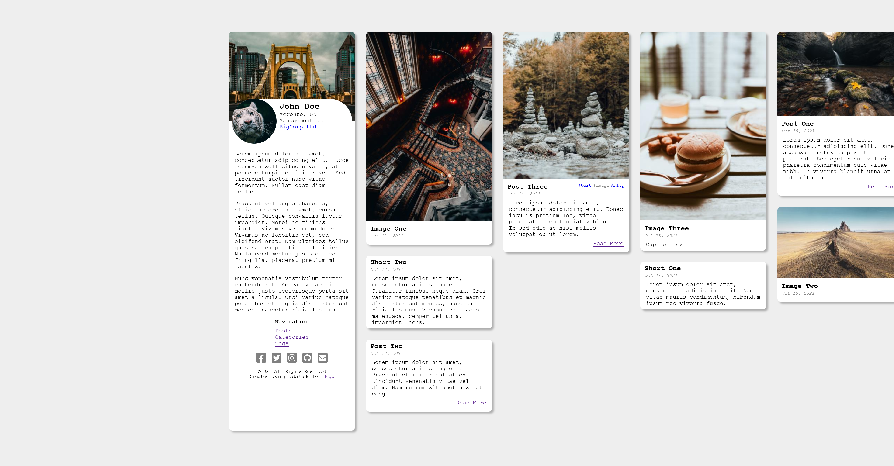

# Latitude for Hugo
A responsive horizontal scrolling masonry theme for the Hugo static site generator.

## Features
- Configurable
- Responsive 
- Supports reader mode
- Dark mode
- Example config for [Netlify CMS](https://www.netlifycms.org/)

## To-Do
- Proper styling when saved to homescreen on mobile devices

## FAQ - Frequently Asked Questions
### How can I configure the profile card?
There's an example file located at data/about.example.yaml
### Where can I find a list of the theme parameters and their default values?
Under data/default.toml in the theme directory
### Why Horizontal?
As a design challenge
### Where is the config for Netlify CMS
In data/netlify-cms.example.yml To use the contents should be copied to your projects
static/admin/config.yml as part of the setup process.

## Acknowledgements
Inspired by the theme [Dream](https://github.com/g1eny0ung/hugo-theme-dream) by Yue Yang

Includes the css + webfont version of [Font Awesome](https://fontawesome.com) free v5.15